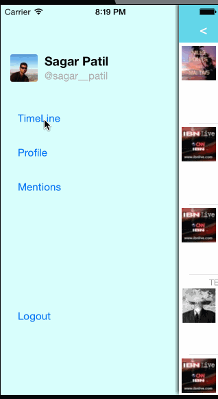

Basic Twitter Client
======

This is an iOS 7 demo app displaying tweets using Twitter API. 

Time spent: approximately 15 hours

Features
---------

- Hamburger menu
- [x] Dragging anywhere in the view should reveal the menu.
- [x] The menu should include links to your profile, the home timeline, and the mentions view.
- [x] The menu can look similar to the LinkedIn menu below or feel free to take liberty with the UI.

- Profile page
- [x] Contains the user header view
- [x] Contains a section with the users basic stats: # tweets, # following, # followers

- Home Timeline
- [x] Tapping on a user image should bring up that user's profile page

Walkthrough
------------

Credits
---------
* Twitter API
* [AFNetworking](https://github.com/AFNetworking/AFNetworking)
* [MBProgressHUD](https://github.com/matej/MBProgressHUD) for loading indicator
* DateTools
* Mantle
* BDBOAuth1Manager

